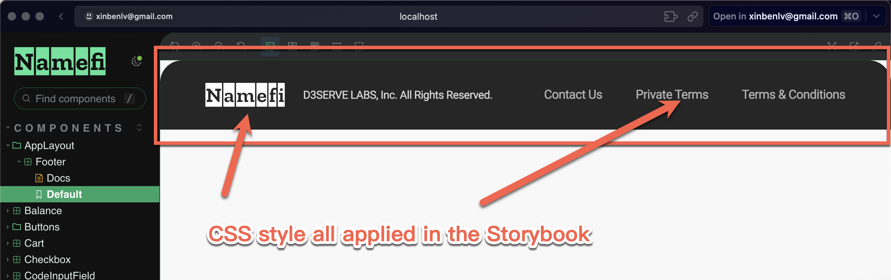
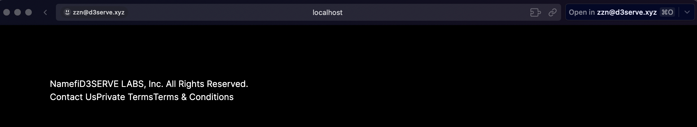

## Question about how to build a React Shared Component with TailwindCSS

1. In the shared library (repo: https://github.com/d3servelabs/namefi-storybook), we can see that CSS correctly applied. 


To view a online instance: 
visit https://storybook.namefi.dev/

or build locally and view it:

```sh
git clone https://github.com/d3servelabs/namefi-storybook.git
cd namefi-storybook
npm install
npm run storybook
# visit http://localhost:6006/
```

2. but when referencing this library from a webapp repo, you can see the CSS was not appied 



To view a online instance: 
visit https://learn-nestjs-app.vercel.app/

or build locally and view it:

```sh
git clone git@github.com:xinbenlvlearn-nestjs-app.git
cd learn-nestjs-app
npm install
npm run dev
# visit http://localhost:3000/
```
